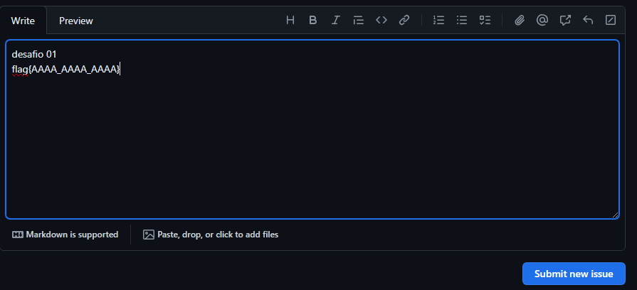

# Desafios

Algumas aulas terão desafios embutidos, todos estarão localizados nesse diretório, aulas com desafios são representadas por um "$" no **nome do arquivo**
por exemplo:

essa aula teria um desafio:
```md
*aula-com-desafio$.md*
```
Essa aula **não** tem um desafio
```md
*aula-com-desafio.md*
```

Agora que você sabe identificar uma aula com desafios, você precisa saber resolve-los, cada desafio tem uma **Flag**, uma flag é um séries de caracteres aleatórios (ou não) usadas para provar que você realmente completou o desafio, as flags normalmente serão colocadas em arquivos (os nomes podem variar de flag.txt até algum nome aleatório, a graça é procurar as flags)

Agora que você sabe identificar e resolver as flags, você precisa saber como envia-las, nosso modelo foi baseado na plataforma *Hack The Box*, só que adaptado, primeiro, você abre uma [**issue**](https://github.com/Cursos-dev-Brasil/Curso-Hacking-2024/issues/new) no repositóro com o nome do desafio e a flag, por exemplo:



Sua imagem vai ser analisada pela equipe, e vai ser respondida o mais rápido possível

Se a resposta da equipe for Correto, obviamente você acertou
Se a resposta da equipe for Errado, você errou
Se a resposta da equipe for Quase, você cometeu algum erro, mas está quase lá

obs: No titulo da issue, coloque o desafio, por exemplo desafio-stegnography.md, na descrição a flag, certifique-se de não clicar em uma issue de um desafio que você não resolveu. A issue será apagada 24h após a resposta da equipe

# Resumo:

Identificar aulas com desafios: Procure por $ no nome do arquivo markdown.

Localizar a flag: Cada desafio possui uma flag, que é uma sequência de caracteres que serve como prova de conclusão. As flags geralmente estão ocultas em arquivos dentro da aula, com nomes que podem variar.

Resolver o desafio: Utilize suas habilidades e conhecimentos adquiridos na aula para completar o desafio.

Enviar a flag: Crie uma issue no repositório GitHub [https://github.com/Cursos-dev-Brasil/Curso-Hacking-2024/issues/new], incluindo o nome do desafio no título e a flag na descrição.

Aguardar resposta da equipe: A equipe analisará sua issue e responderá o mais rápido possível.

Correto: Você completou o desafio com sucesso.

Errado: Você cometeu um erro na resolução do desafio.

Quase: Você está no caminho certo, mas precisa revisar sua solução.

Observações importantes:

Não clique em issues de desafios que você ainda não resolveu.

As issues serão excluídas 24 horas após a resposta da equipe.